# 👋 Hi there, I'm ara-ta3!

- 🚀 Engineer & Engineering Manager
- 🧪 Passionate about Scala, TypeScript, and clean code
- 🏗️ Enjoys designing robust architectures and practical domain models
- 💬 Favorite principles: "Fail fast", "Type safe by default", "The code is the documentation"
- 🐱 Living with a lovely cat

## 🛠️ Personal Projects

- 🔹 [My Portfolio](https://ara-ta3.github.io/) - This site serves as both my portfolio and a playground for trying out new technologies.
- 🔹 [Nekometry](https://nekometry.web.app/?utm_source=github&utm_medium=referral) – A cat nutrition calculator for Japanese users, designed with TypeScript and React.

## 📜 Templates

- 🔹 https://github.com/ara-ta3/WebBoilerplate - Frontend Boilerplate in TypeScript

## 🔧 GitHub Stats / Streak

## 📊Metrics

<picture>
  
</picture>

